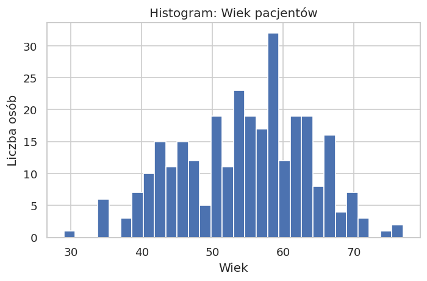
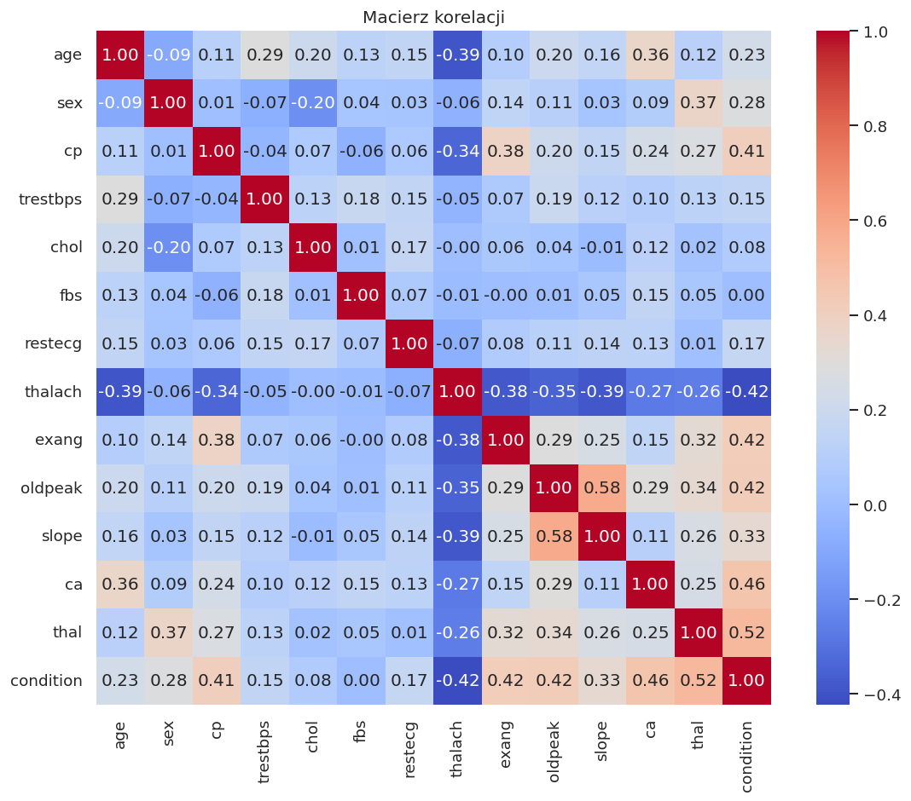
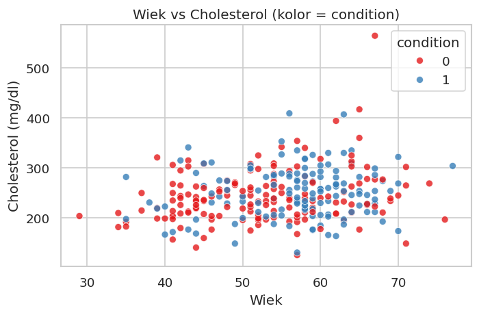
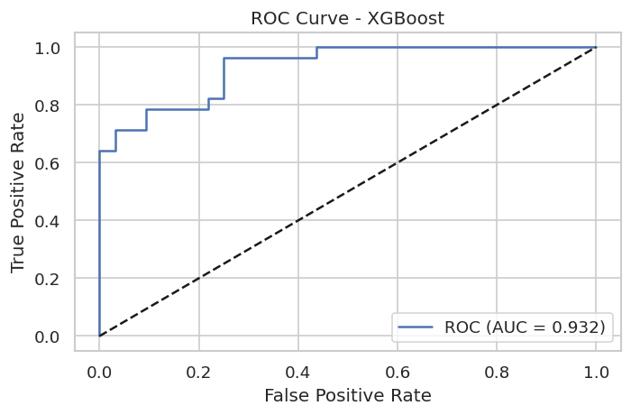
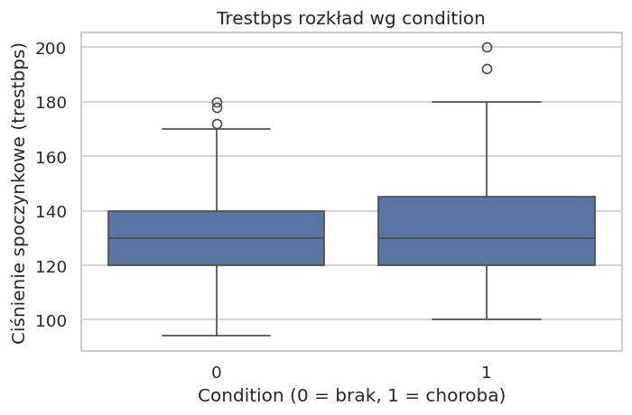
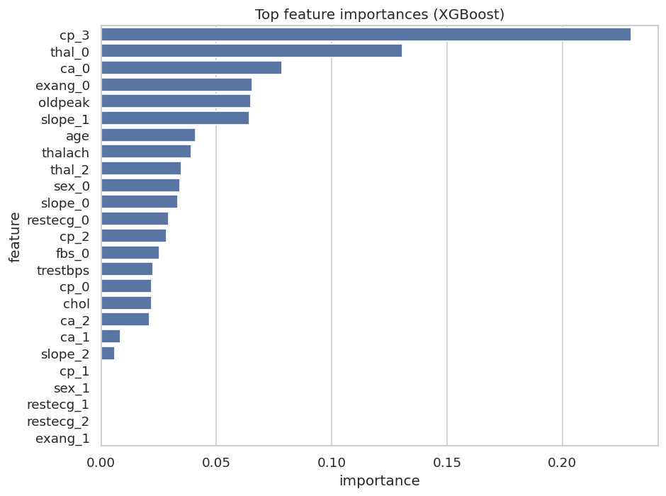

# Heartdiseaseprediction

# Heart disease prediction with XGBoost

## Purpose
Project purpose is to build ML model, which predict patients heart disease risk factor using simple clinical parameters. In this project **XGBoost** algorithm was use. It is common knowledge that this alogirithm us highly usefull in classification of medical data matrix.

## Technologies
- Python
- pandas, numpy
- matplotlib, seaborn
- SciPy
- scikit-learn
- XGBoost

## Data 
Data set: **Heart Disease UCI** (Cleveland). 
Source: Kaggle
File 'heart.csv' in placed 'data/'

## EDA data exploration
Project contains:
- checking for missing data,
- descriptive statistics,
- variable distributions,
- correlations,
- visualization (including scatter plots, boxplots and heatmaps).

Chart example:

  

## ML method
Model: **XGBoostClassifier**
Pipeline:
- standarize,
- train/test split,
- tuning hiperparameters (GridSearchCV),
- Model evaluation:
  - accuracy  
  - precision  
  - recall  
  - ROC AUC  

### Model results:
- Acuuracy...
- ROC AUC...

## Feature importance
XGBoost allows for easy interpretation of the importance of clinical variables.

  

## Conclusions
...

# Possible extensions
- SHAP values ​​(prediction explainability)
- Connection to laboratory data
- WebAPI for new patient prediction

Przykład markdown do README (zakładamy, że folder 'figures' trafi do repozytorium):

